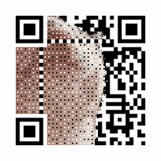

## Hi there 👋 I am Ailin Wang!

  

#### I am an enthusiast who loves to explore the latest models and technologies in the field of data science and deep learning. I have a huge interest in NLP and various forms of attention-based models (e.g., TransFormer, Auto-Regressive Models, FastFormer...).
#### Exploratory Data Analysis | Predictive Analytics | MLOps | Attention-based Models
- 🌱 I'm currently a graduate student at the Graduate School of Arts and Sciences, University of Tokyo. I have a Master's Degree in the field of Multidisciplinary Sciences and a Bachelor's Degree in Chemistry, and I would like to apply my skills to solve both life science related and real-world problems.
- Statistical methods such as machine learning and neural networks have shown great potential in many chemical and biological applications such as virtual screening and molecular property prediction, and I would like to explore the potential of the latest models and technologies in applications such as 
Molecular Property Prediction and Automated Molecule Generation.
- Furthermore, I would like to learn more about MLOps for continuous delivery and automation pipelines in solving real-world problems in data-driven approaches!

### 🔭 My Recent Projects

| Project                                                                                  | Description                                                                                                                                                    |
|------------------------------------------------------------------------------------------|----------------------------------------------------------------------------------------------------------------------------------------------------------------|
| Language Model Based Music Recommendation System - SonglistML                            | [Spotify Million Playlist Dataset Challenge](https://www.aicrowd.com/challenges/spotify-million-playlist-dataset-challenge)                                    |
| Sentiment Analysis with Emotes - EmoteML                                                 | Sentiment Analysis on speech-to-text data with Emotes using Attention-Based Neural Networks                                                                    |

<h3 align="left">Languages and Tools:</h3>

 
     
  
 
       

- 💬 Mandarin Chinese / English / Japanese
- 😄 Pronouns: She/Her
- ⚡ Fun fact: I'm a huge coffee nerd ☕. My favorite band is Men I Trust 🎸!

<!--
**bunnythecat/bunnythecat** is a ✨ _special_ ✨ repository because its `README.md` (this file) appears on your GitHub profile.
-->
